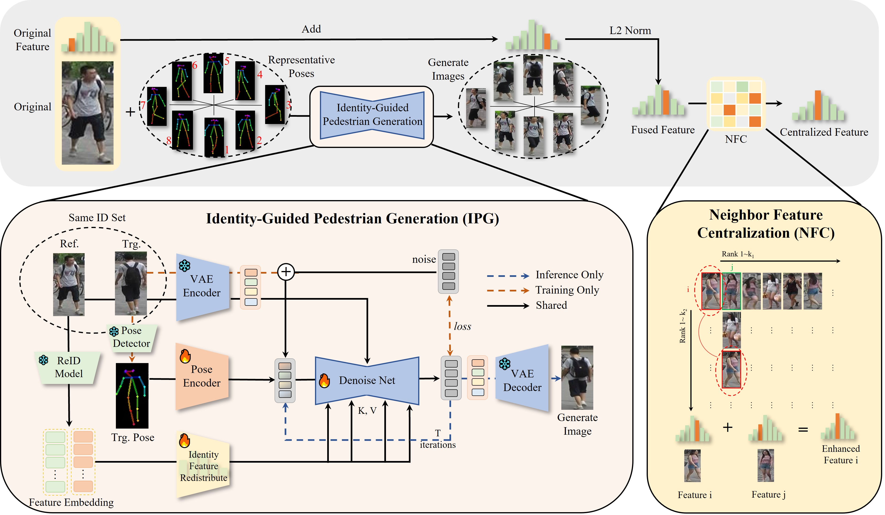
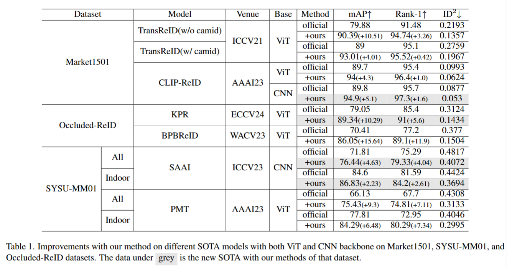
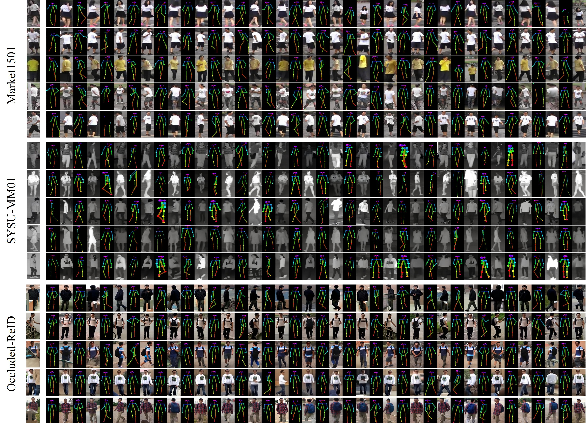

<h1 align='center'>From Poses to Identity: Training-Free Person Re-Identification via Feature Centralization</h1>

<div align='center'>
    <a href='https://github.com/yuanc3' target='_blank'>Chao Yuan</a><sup>*</sup>&emsp;
    <a href='https://github.com/zhangguiwei610' target='_blank'>Guiwei Zhang</a><sup>*</sup>&emsp;
    <a href='https://github.com/maxiaoxsi' target='_blank'>Changxiao Ma</a><sup></sup>&emsp;
    <a href='https://github.com/sapphire22' target='_blank'>Tianyi Zhang</a><sup></sup>&emsp;
    <a href='https://github.com/ngl567'  target='_blank'>Guanglin Niu</a><sup></sup>
</div>

<div align='center'>
Beihang University
</div>
<br>
<!-- <div align='center'>
    <a href='https://arxiv.org/'></a>
</div> -->


We proposed:
- _**Training-Free Feature Centralization framework (Pose2ID)**_ that can be directly applied to different ReID tasks and models, even an ImageNet pre-trained model without ReID training;
- _**I**dentity-Guided **P**edestrian **G**eneration (**IPG**)_ paradigm, leveraging identity features to generate high-quality images of the same identity in different poses to achieve feature centralization;
- _**N**eighbor **F**eature **C**entralization (**NFC**)_ based on sample’s neighborhood, discovering hidden positive samples of gallery/query set to achieve feature centralization.




## &#x1F4E3; Updates
* [2025.03.03] 🔥 Paper will be available on Arxiv in few days!
* [2025.03.03] 🔥 Official codes has released!
* [2025.02.27] 🔥🔥🔥 **Pose2ID** is accepted to CVPR 2025!


## ⚒️ Quick Start

There are two parts of our project: **Identity-Guided Pedestrian Generation (IPG)** and **Neighbor Feature Centralization (NFC)**.

**IPG** using generated pedestrian images to centralize features. Using simple codes could implement:

```bash
'''
normal reid feature extraction to get feats
'''
feats_ipg = torch.zeros_like(feats)
# fuse features of generated positive samples with different poses
for i in range(num_poses):
    feats_ipg += reid_model(feats_pose[i]) # Any reid model
eta = 1 # control the impact of generated images (considering the quality)
# centralize features and normalize to original distribution
feats = torch.nn.functional.normalize(feats + eta * feats_ipg, dim=1, p=2) # L2 normalization
'''
compute distance matrix or post-processing like re-ranking
'''
```

**NFC** explores each sample's potential positive samples from its neighborhood. It can also implement with few lines:

```bash
from NFC import NFC
feats = NFC(feats, k1 = 2, k2 = 2)
```

## 📊 Experiments

### ID² Metric
We proposed a quantitative metric (ID²) for **Id**entity **D**ensity to replce visualization tools like t-SNE, which is random and only focus on few samples.

It can be used in one line:
```bash
from ID2 import ID2
density = ID2(feats, pids) # each ID's density
density.mean(0) # global density
```
where `feats` is the features extracted by ReID model and `pids` is the corresponding person IDs.


### Improvements on Person ReID tasks
 

All the experiments are conducted with the **offcial codes** and **pretrained models**. We appreciate their official repositories for their great works:
- TransReID
<a href='https://github.com/damo-cv/TransReID'></a> <a href='https://arxiv.org/pdf/2102.04378'></a>
- CLIP-ReID
<a href='https://github.com/Syliz517/CLIP-ReID'></a> <a href='https://arxiv.org/pdf/2211.13977'></a>
- KPR
<a href='https://github.com/VlSomers/keypoint_promptable_reidentification'></a> <a href='https://arxiv.org/pdf/2407.18112'></a>
- BPBReID
<a href='https://github.com/VlSomers/bpbreid'></a> <a href='https://arxiv.org/pdf/2211.03679'></a>
- SAAI
<a href='https://github.com/xiaoye-hhh/SAAI'></a> <a href='https://openaccess.thecvf.com/content/ICCV2023/papers/Fang_Visible-Infrared_Person_Re-Identification_via_Semantic_Alignment_and_Affinity_Inference_ICCV_2023_paper.pdf'></a>
- PMT 
<a href='https://github.com/hulu88/PMT'></a> <a href='https://arxiv.org/pdf/2212.00226'></a>
  
### Model without ReID training

TransReID loads a [ViT pre-trained model on ImageNet](https://huggingface.co/google/vit-base-patch16-224) for
training on the ReID task. This experiment conduct on that pre-trained model which is **NOT trained on ReID task**.
<p align="center">
  
  
</p>

### Ablation Studies


### Random Generated Images


## 🚀 IPG Installation

### Download the Codes

```bash
git clone https://github.com/yuanc3/Pose2ID
cd Pose2ID/IPG
```

### Python Environment Setup
Create conda environment (Recommended):

```bash
conda create -n IPG python=3.9
conda activate IPG
```

Install packages with `pip`
```bash
pip install -r requirements.txt
```

### Download pretrained weights
1. Download official models from: 
    - [sd-vae-ft-mse](https://huggingface.co/stabilityai/sd-vae-ft-mse)
    - [stable-diffusion-v1-5](https://huggingface.co/stable-diffusion-v1-5/stable-diffusion-v1-5)
1. Download our IPG pretrained weights from [Google Drive](https://drive.google.com/drive/folders/1q5MNFMB1FV74Xy2vPo43k3tbOthQijDS?usp=sharing) and put them in the `pretrained` directory.

    The **pretrained** are organized as follows.

    ```
    ./pretrained/
    ├── denoising_unet.pth
    ├── reference_unet.pth
    ├── IFR.pth
    ├── pose_guider.pth
    └── transformer_20.pth
    ```

### Inference
Run the `inference.py` script. It will generate with poses in the `standard_poses` for each reference image in `ref`. The output images will be saved in the `output`.

```bash
python inference.py --ckpt_dir pretrained --pose_dir standard_poses --ref_dir ref --out_dir output
```
`--ckpt_dir`: directory of pretrained weights,\
`--pose_dir`: directory of target poses (we provide 8 poses used in our experiment), \
`--ref_dir`: directory of reference images (we provide 10 reference imgs), \
`--out_dir`: directory of output images.


### Official generated images on Market1501 
Here, we provide our generated images on [Gallery](https://drive.google.com/file/d/1QdH0CctiUrZTCE3nPzc_kPmgAaxhhWzd/view?usp=sharing) and [Query](https://drive.google.com/file/d/1oiOutY64FQn9RTF2l_T0A8iPCWMkJi3a/view?usp=sharing) of test set on Market1501 with our 8 representative poses. 


### Getting target poses 
We use [DWpose](https://github.com/IDEA-Research/DWPose) to get poses with 18 keypoints.Please follow their official instructions.


## 📝 Release Plans

|  Status  | Milestone                                                                | ETA |
|:--------:|:-------------------------------------------------------------------------|:--:|
|    🚀    | Training codes       | TBD |
|    🚀    | IPG model trained on more data       | TBD |
|    🚀    | IPG model with modality transfer ability (RGB2IR)      | TBD |
|    🚀    | Video-IPG model      | TBD |

<!-- ## 📒 Citation

If you find our work useful for your research, please consider citing the paper:

```bash

``` -->
